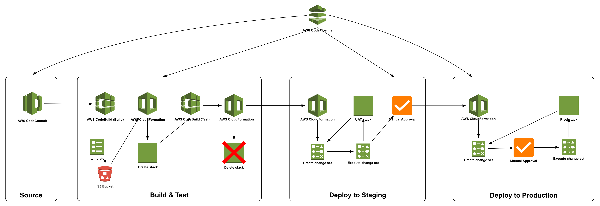

# AWS Automation

Stand up layers 1-5 of the Democracy application on AWS.

## :rocket: Quick Start

1. Install Python packages

  ```shell
  pyton3 -m pip install -r requirements.txt
  ```

2. Deploy resources on AWS

  ```shell
  python3 -m setup
  ```

## Deploy AWS



1. Create codepipeline

```shell
aws cloudformation create-stack --stack-name Democracy-CodePipeline --template-body file://development/codepipeline.yml --capabilities CAPABILITY_NAMED_IAM
```

## TODO

- [ ] Automate deployment of backend (EC2 for python migration)
- [ ] Automate deployment of Lambdas to invoke python migrations
- [ ] Automate deployment of S3 bucket for bill migration data
- [ ] Automate deployment of front end
